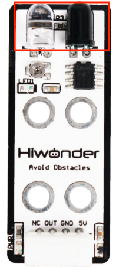

# 1. Infrared Obstacle Avoidance Sensor Manual

## 1.1 Infrared Obstacle Avoidance Sensor Description

### 1.1.1 Sensor Introduction

The infrared obstacle avoidance sensor is used for detecting obstacle ahead. It has an infrared transmitting tube and an infrared receiving tube. Once the sensor encounters an obstacle, the infrared light will be reflected back and received by the receiving tube. It is widely used for automatic obstacle avoidance in smart cars and robotics.

### 1.1.2 Working Principle

When the infrared receiving tube does not receive infrared light, the signal terminal OUT will output a high-level signal; when it receives infrared light, the signal terminal OUT will output a low-level signal.

During operation, you can determine whether there is an obstacle ahead by reading the status of the sensor's OUT signal pin. In addition, the sensor is equipped with a miniature potentiometer, which can be rotated to adjust the detection range. If you adjust the potentiometer to the threshold between ON and OFF, the sensor will achieve its maximum detection distance.

## 1.2 Notice

1.  Do not exceed the rated voltage range during use.

2.  Do not use materials that transmit visible light or infrared light as test objects.

3.  Avoid strong light exposure and do not block the light on the test object during use.

4.  Do not operate the sensor in humid environments.

## 1.3 Specifications

For more information of this chip, you may refer to **"[Infrared obstacle avoidance sensor schematic](https://drive.google.com/drive/folders/1LSMbVKyZqSLhOy8sA2l3RDGmHRBH7vJ_?usp=sharing)"**

### 1.3.1 Pin Instruction

<table class="docutils-nobg" border="1">
<colgroup>
<col style="width: 45%" />
<col style="width: 54%" />
</colgroup>
<tbody>
<tr>
<td style="text-align: center;"><strong>Pin</strong></td>
<td style="text-align: center;"><strong>Instruction</strong></td>
</tr>
<tr>
<td style="text-align: center;">5V</td>
<td style="text-align: center;">Power Input</td>
</tr>
<tr>
<td style="text-align: center;">GND</td>
<td style="text-align: center;">Ground</td>
</tr>
<tr>
<td style="text-align: center;">OUT</td>
<td style="text-align: center;">
When no obstacle is detected, the output remains HIGH (1).

When an obstacle is detected, the output switches to LOW (0). 
The Detection range is adjustable.
</td>
</tr>
<tr>
<td style="text-align: center;">NC</td>
<td style="text-align: center;">None</td>
</tr>
</tbody>
</table>

### 1.3.2 Specifications

<table  class="docutils-nobg" style="margin:0 auto" border="1">
<colgroup>
<col style="width: 50%" />
<col style="width: 50%" />
</colgroup>
<tbody>
<tr>
<td colspan="2" style="text-align: center;">

<strong>1.Infrared Obstacle Avoidance Sensor</strong>

</td>
</tr>
<!-- 参数与规格表头 -->
<tr>
<td style="text-align: center;">

<strong>Parameter</strong>

</td>
<td style="text-align: center;">

<strong>Specification</strong>

</td>
</tr>
<!-- 各参数行 -->
<tr>
<td style="text-align: center;">

<strong>Working Voltage</strong>

</td>
<td style="text-align: center;">

<strong>DC 5V</strong>

</td>
</tr>
<tr>
<td style="text-align: center;">

<strong>Operating Current</strong>

</td>
<td style="text-align: center;">

<strong>40mA</strong>

</td>
</tr>
<tr>
<td style="text-align: center;">

<strong>Detection Range</strong>

</td>
<td style="text-align: center;">

<strong>2~ 25cm</strong>

</td>
</tr>
<tr>
<td style="text-align: center;">

<strong>LED1 Description</strong>

</td>
<td style="text-align: center;">

<strong>Lights up when an obstacle is detected.</strong>

</td>
</tr>
<tr>
<td style="text-align: center;">

<strong>Detection Range Adjustment Method</strong>

</td>
<td style="text-align: center;">

<strong>Adjustable via miniature potentiometer</strong>

</td>
</tr>
<tr>
<td style="text-align: center;">

<strong>Connector Type</strong>

</td>
<td style="text-align: center;">

<strong>5264-4AW</strong>

</td>
</tr>
<tr>
<td style="text-align: center;">

<strong>Dimensions</strong>

</td>
<td style="text-align: center;">

<strong>50mm×20mm</strong>

</td>
</tr>
<tr>
<td colspan="2" style="text-align: center;">

<strong>Modular installation, compatible with Lego series.</strong>

</td>
</tr>
</tbody>
</table>

## 1.4 Project Outcome

You can refer to the case tutorials and programs for different platforms in the same directory as this tutorial. This section will demonstrate the testing effect using Arduino IDE as an example.

Place an object in front of the infrared obstacle avoidance sensor. When no obstacle is detected, LED1 on the sensor will be OFF, and the serial monitor will display 1. When an obstacle is detected, LED1 will turn ON, and the serial monitor will display 0.