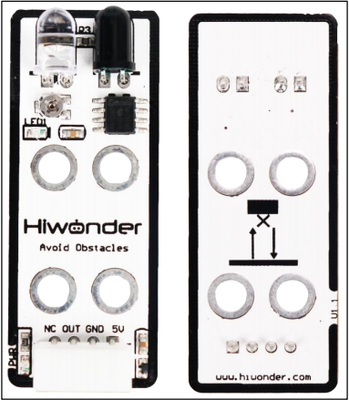
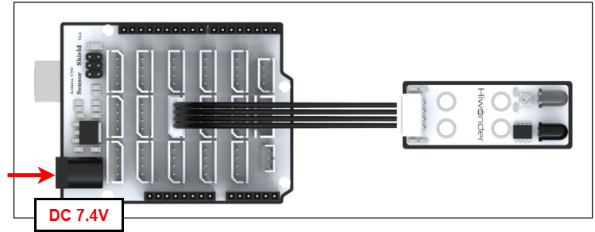
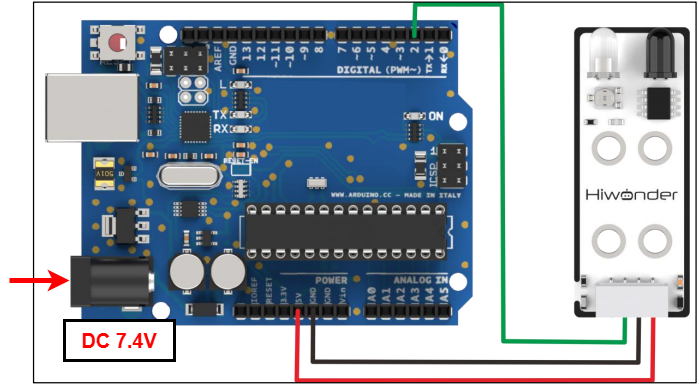
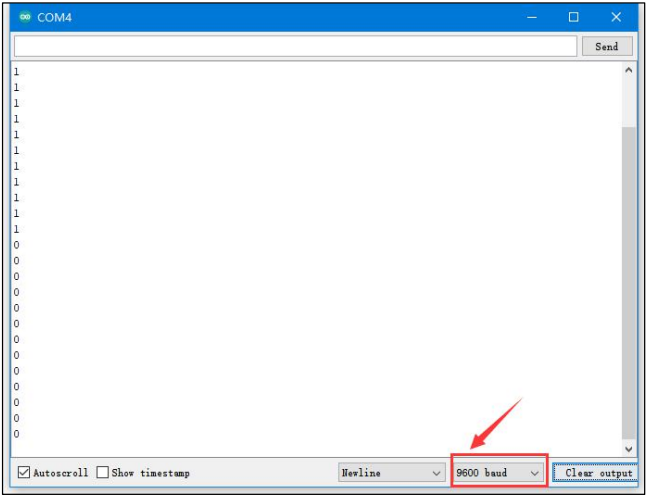
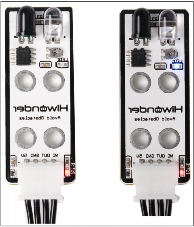

# 2. Arduino Development



## 2.1 Getting Started

### 2.1.1 Wiring Instruction

This section illustrates connecting a 4-pin cable to the A2 and A3 ports on the Arduino expansion board. Refer to the diagram below.



If you do not have an Arduino expansion board, use a Dupont wire to directly connect to the Arduino development board, just as below:



> [!NOTE]
>
> * **When using Hiwonder's lithium battery, connect the battery cable with the red wire to the positive (+) terminal and the black wire to the negative (–) terminal of the DC port.**
>
> * **If the battery is not connected to the cables, do not connect the cable ends directly together. Doing so may cause a short circuit and damage the system.**
>
> * **Before powering on, ensure that no metal objects are touching the controller. Otherwise, the exposed pins at the bottom of the board may cause a short circuit and damage the controller.**

### 2.1.2 Environment Configuration

You can install the Arduino IDE on a PC. Download path: **"[Appendix-> Arduino Installation Package.](https://drive.google.com/drive/folders/1r9onuphixUOFbGZOVBi8gtkjql9qDyzq?usp=sharing)"** For detailed usage of the Arduino IDE, please refer to the documentation in the same directory.

## 2.2 Test Case

Program to show the infrared avoidance sensor's obstacle detection status in the terminal window.

### 2.2.1 Program Download

1. Connect the Arduino UNO development board with the expansion board to the computer via a USB cable. You can open Arduino IDE, click "**File → New**," and import the program located in the same directory as this tutorial.

2. Remember to select the correct development board and port. The ports shown below are for reference only. Then compile and upload the program.


3. After the code is uploaded, click  to open the serial monitor, set the baud rate to 9600 to observe the output.

### 2.2.2 Project Outcome

Place an object in front of the infrared obstacle avoidance sensor. When no obstacle is detected, LED1 on the sensor will be OFF, and the serial monitor will display 1. When an obstacle is detected, LED1 will turn ON, and the serial monitor will display 0.





### 2.2.3 Program Brief Analysis

- **Serial Port Initialization**

```py
#define IR 8   //Define the signal pin of the infrared obstacle avoidance sensor to connect to digital pin 8 on the control board.
uint8_t IR_value;
void setup()
{
  Serial.begin(9600);
  pinMode(IR, INPUT); //Configure IR as input (the input state is generally to read the state of this pin, that is, to read the feedback value of the sensor)
}
```

Initialize the infrared obstacle avoidance sensor's output pin to digital pin 8. Define a variable to store the value returned by the IR sensor. In the setup function, initialize the serial port and set the IR pin as input.

- **Loop Process**

```py
void loop()
{
  IR_value= digitalRead(IR);
  Serial.println("Blue");
  delay(500);
}
```

Read the IR sensor value in `loop()` and print it to the terminal.