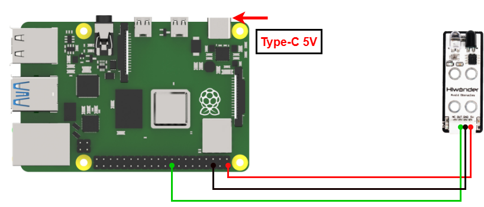
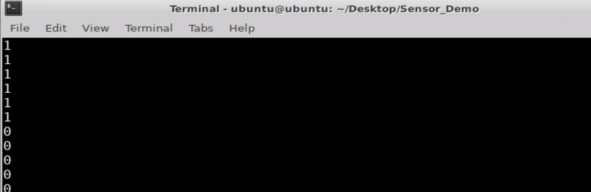

# 3. Raspberry Pi Development Tutorial


## 3.1 Getting Started

### 3.1.1 Wiring Instruction

This section uses DuPont wires to connect the infrared obstacle avoidance sensor's 5V, GND, and OUT (GPIO 24) as an example, the connection method is shown in the figure below:



> [!NOTE]
>
> * **When using Hiwonder's lithium battery, connect the battery cable with the red wire to the positive (+) terminal and the black wire to the negative (–) terminal of the DC port.**
>
> * **If the battery is not connected to the cables, do not connect the cable ends directly together. Doing so may cause a short circuit and damage the system.**
>
> * **Before powering on, ensure that no metal objects are touching the controller. Otherwise, the exposed pins at the bottom of the board may cause a short circuit and damage the controller.**

### 3.1.2 Environment Configuration

Install NoMachine on your computer. The software package is located under "**[Appendix-> Remote Desktop Connection Tool](https://drive.google.com/drive/folders/1xTWUOyB90ZBDLHZxsUVuRazn9sHXQeTP?usp=sharing)**". For the detailed operations of NoMachine, please refer to the same directory.

Drag the program and SDK library files into the Raspberry Pi system image. For demonstration purposes, the files are placed on the Desktop in this example. 

> [!NOTE]
>
> **Make sure the library files are placed in the same directory as the program.**

Open the terminal and enter the command to change to the program directory: 

```bash
sudo chmod a+x Sensor_Demo/
```

## 3.2 Test Case

Program to show the infrared sensor's obstacle detection status in the terminal window.

### 3.2.1 Program Download

1. Open the terminal and enter the command to navigate to the program directory, enter: **cd Desktop/Sensor_Demo/**, then press Enter.

```bash
cd Desktop/Sensor_Demo/
```

2. To run this example program, enter: 

```bash
python3 InfraredSensorDemo.py
```

### 3.2.2 Project Outcome

If the infrared obstacle avoidance sensor does not detect an obstacle, it prints "**1**"; if it detects an obstacle, it prints "**0**".



### 3.2.3 Program Brief Analysis

- **Import Libraries**

```py
#!/usr/bin/env python3
import os
import sys
import time
import RPi.GPIO as GPIO
```

- **Initialize Serial Port**

```py
GPIO.setwarnings(False)
GPIO.setmode(GPIO.BCM)
```

Disable the GPIO module warning message and set the pin mode to BCM numbering.

- **Check the running Python version**

```py
if sys.version_info.major == 2:
    print('Please run this program with python3!')
    sys.exit(0)
```

Check if the running Python version is 3.0 or higher.

If yes, the program runs normally; if not, it prints a message via the `print()` function and exits.

- **Print the detection status of the infrared obstacle avoidance sensor.**

Continuously read and print the status of GPIO 24 every 0.2 seconds until the program is manually stopped.

```py
while True:
    GPIO.setup(24, GPIO.IN) # Set pin as input mode (设置引脚为输入模式)
    state = GPIO.input(24)  # Read digital value from the pin (读取引脚数字值)
    
    print(state)
    time.sleep(0.2)
```