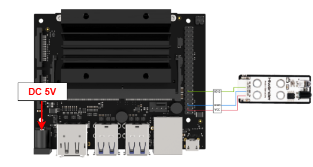
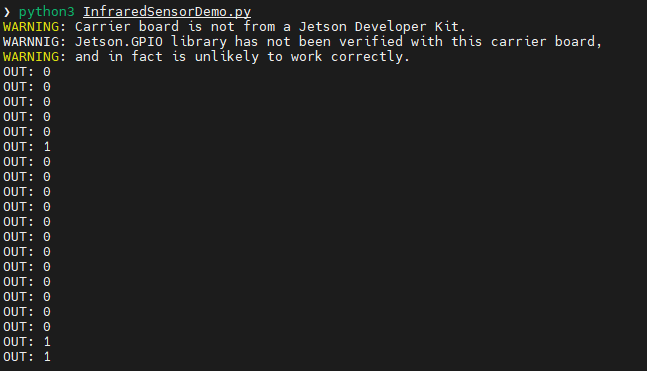

# 4. Jetson Nano Development Tutorial


## 4.1 Getting Started

### 4.1.1 Wiring Instruction

This section uses DuPont wires to connect infrared obstacle avoidance sensor. For wiring instructions, refer to the figure below:



> [!NOTE]
>
> **Note: Before powering on, ensure that no metal objects are touching the controller. Otherwise, the exposed pins at the bottom of the board may cause a short circuit and damage the controller.**

### 4.1.2 Environment Configuration

Install NoMachine on your computer. The software package is located under "**[2 Software Tools & Programs -\> 01 Software Installation Package -\> Remote Desktop Connection Tool -\> 1 Remote Desktop Connection Tool](https://drive.google.com/drive/folders/1xTWUOyB90ZBDLHZxsUVuRazn9sHXQeTP?usp=sharing)"**. For detailed usage of NoMachine, refer to the materials in the same directory.

**Drag the program into the Jetson Nano system image, taking placing it on the desktop as an example.**

Open the terminal and enter the command to navigate to the program directory, enter:

```bash
cd Desktop/
```

## 4.2 Test Case

This example displays the values detected by the infrared obstacle avoidance sensor in the terminal window.

### 4.2.1 Program Execution

1. Open the terminal and enter the command to navigate to the program directory, enter:

```bash
cd Desktop/
```

2. To run this example program, enter:

```bash
python3 InfraredSensorDemo.py
```

### 4.2.2 Project Outcome

The infrared obstacle avoidance sensor prints "**1**" when no obstacle is detected and prints "**0**" when an obstacle is detected.



## 2.3 Program Brief Analysis

- **Import Libraries**

```py
#!/usr/bin/env python3
import Jetson.GPIO as GPIO
import time
```

Import the library files required by the program, including the library files needed for delay and the library files for using GPIO pins on the Jetson controller.

- **Initialization**

```py
def main():
    # Initialize I/O pin (初始化IO口)
    GPIO.setmode(GPIO.BCM)
    GPIO.setup(18, GPIO.IN)  # Set pin as input mode (设置引脚为输入模式)
```

Initialize the GPIO port and set the GPIO mode to BCM mode. Set pin 18 used by the infrared obstacle avoidance sensor module and configure it as input mode.

- **Main Function**

In the while loop, assign the data read from GPIO pin 18 to the state variable. Then print out the variables stored in the state and set them to be refreshed every 0.5 seconds, looping in turn.

```py
while True:
        state = GPIO.input(18)
        print("OUT:",state) # Print I/O pin status (打印IO口信息)
        time.sleep(0.5) # Refresh button status every 500 ms (500毫秒刷新一次按钮状态)
```

